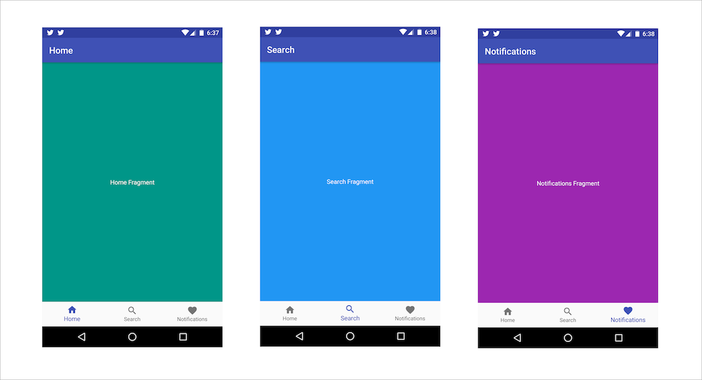

# BottomNavigationView demo
Demo app for the new [BottomNavigationView](https://developer.android.com/reference/android/support/design/widget/BottomNavigationView.html) in Android Support library.

Follow up blog post is here: https://segunfamisa.com/posts/bottom-navigation-view-android

# Requirements
  * Android Studio
  * Android SDK & tools (version 25)
    * Android SDK tools 25.X.Y
    * Android Build-tools 25
    * Android SDK Platform-tools 25

# Gif Demo

# Screenshots

# Contribution
Contributions are welcome. Feel free to submit a pull request to contribute to this demo project.

# License
Apache v2.0
